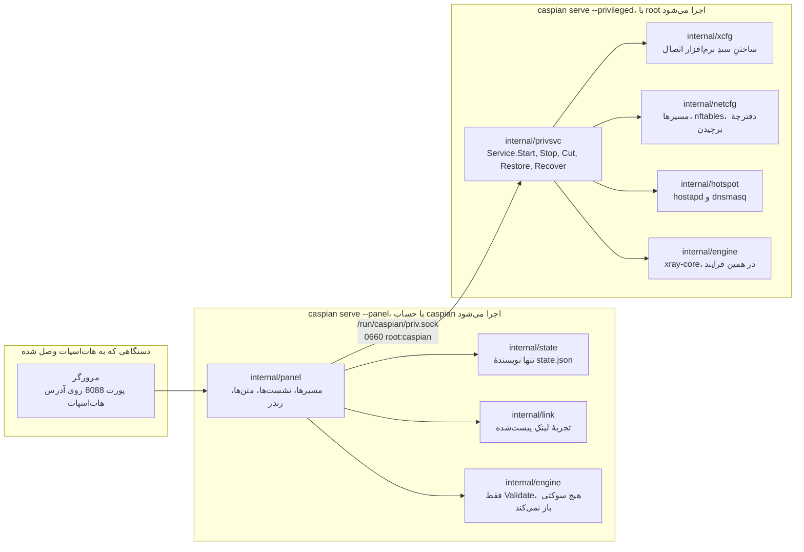
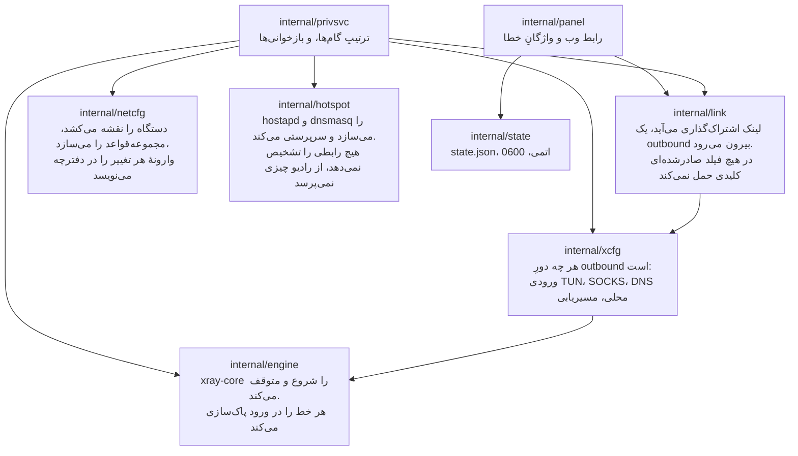
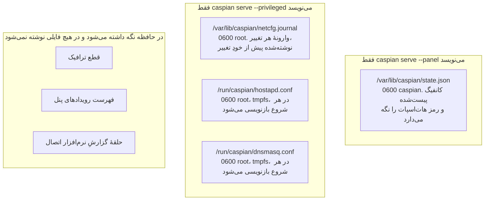
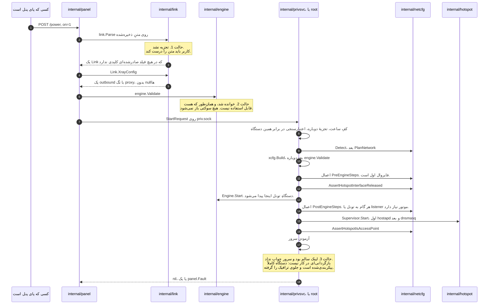
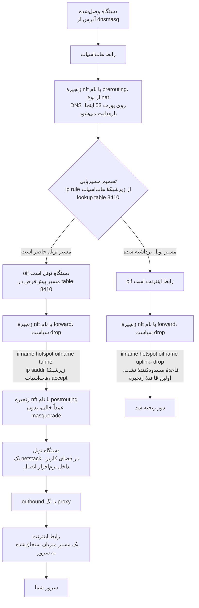
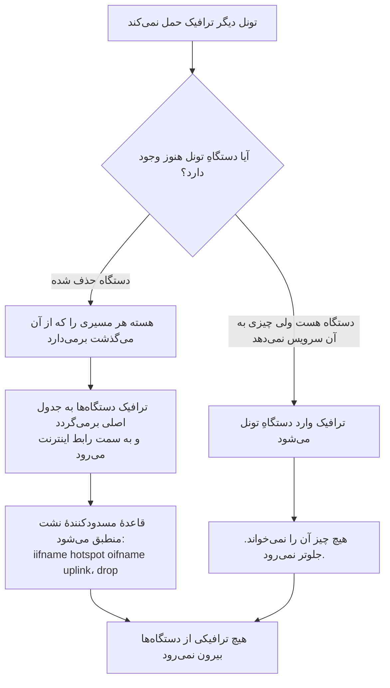
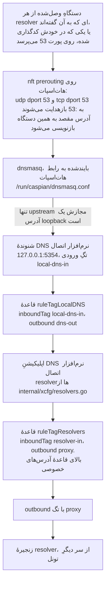
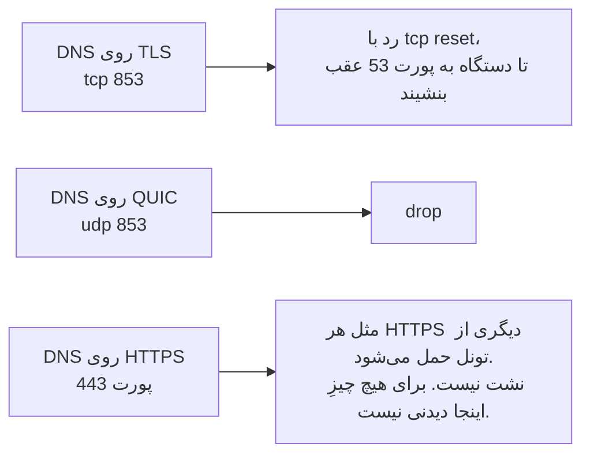
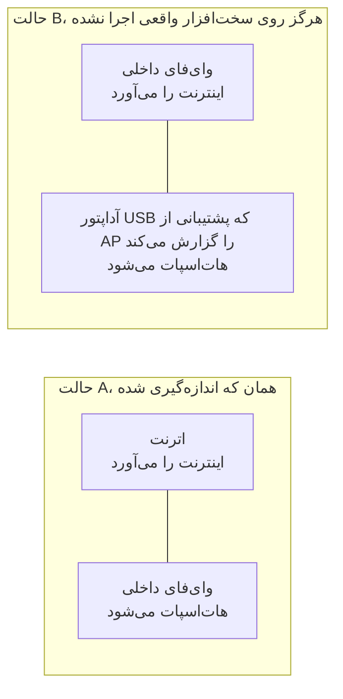
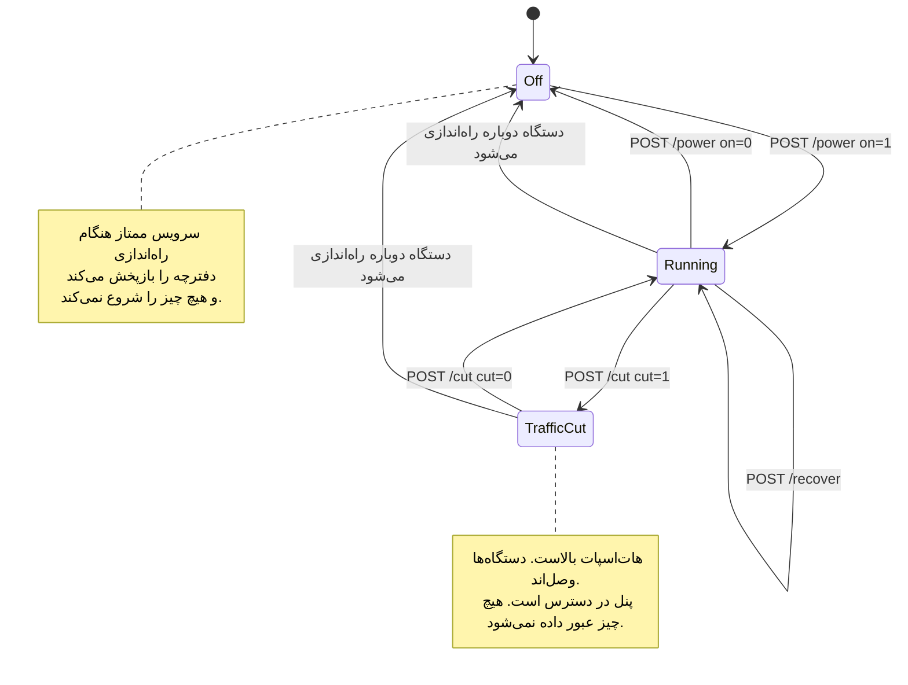

<div dir="rtl" align="right">

# Caspian-BYOC

[**دانلود آخرین نسخه**](https://github.com/Iman/caspian/releases/latest) | [**باز کردن ویکی**](https://github.com/Iman/caspian/wiki/Home.fa)

<div dir="ltr" align="left">

[English](README.md) | [فارسی](README.fa.md) | [Русский](README.ru.md) | [中文](README.zh.md) | [العربية](https://github.com/Iman/caspian/wiki/Home.ar) | [اردو](https://github.com/Iman/caspian/wiki/Home.ur) | [Türkçe](https://github.com/Iman/caspian/wiki/Home.tr)

</div>

<div dir="ltr" align="left">

[](https://github.com/Iman/caspian/actions/workflows/ci.yml) [](https://github.com/Iman/caspian/releases/latest) [](LICENSE) [](https://github.com/Iman/caspian/releases/latest) [](https://github.com/Iman/caspian/pkgs/container/caspian) [](https://deepwiki.com/Iman/caspian)

</div>


Caspian-BYOC یک کامپیوتر Windows، یک Mac با macOS، یک Raspberry Pi یا یک
دستگاه Linux را به دروازهٔ وای‌فای تبدیل می‌کند که کانفیگش را خودتان می‌آورید.
یک کانفیگ سازگار با V2Ray یا Xray را در پنل وب پیست کنید و یک کلید را بزنید.
Caspian لینک‌های VLESS،
VMess، Shadowsocks، SOCKS، Trojan و Hysteria2 را می‌پذیرد. فایل‌های YAML مربوط
به Clash و Clash.Meta، فایل JSON خامِ Xray، فهرست لینک‌ها و اشتراک base64 نیز
پذیرفته می‌شوند. Caspian با Xray-core وصل می‌شود و تونل را به شکل هات‌اسپات
وای‌فای پخش می‌کند، پس هر دستگاهی که وصل شود بدون نصب برنامه محافظت می‌شود.
کنترل‌های اختیاری ضد DPI (عبور از DPI)، یعنی جعل SNI و تکه‌کردن TLS، کمک می‌کنند اتصال در شبکه‌هایی که ترافیک را بازرسی می‌کنند برقرار شود.


تصویرِ بالا یک اسکرین‌شاتِ واقعی از یک دستگاهِ در حالِ کار است، گرفته‌شده روی یک
Raspberry Pi 5 در تاریخ 2026-09-03 با تونلِ بالا و پیش از آنکه دستگاهی وصل شود.
رمزِ شبکه، نامِ کانفیگ و آدرسِ سرور در آن جایگزین شده‌اند، و کدِ تصویریِ اتصال تار
شده، چون آن کد نامِ شبکه و رمزش را در خودش دارد. هیچ چیزِ دیگری تغییر نکرده است.

پنل به‌صورت پیش‌فرض انگلیسی است. از فهرست زبان در بالای صفحه، فارسی را انتخاب کنید. هیچ حسابی در کار نیست، هیچ داده‌ای از شما
فرستاده نمی‌شود، و پنل به خودی خود چیزی از اینترنت نمی‌گیرد، مگر آنکه شما روی
نشانی اشتراکی که ذخیره کرده‌اید دکمهٔ تازه‌سازی را بزنید.


## ضد DPI: جعل SNI و تکه‌کردن TLS

بازرسی عمیق بسته (DPI) روشی است که شبکه با آن آغاز یک اتصال را می‌خواند تا تصمیم بگیرد آن را مسدود کند یا نه. کاسپین سه کنترل اختیاری ضد DPI (عبور از DPI) دارد که در پنل، کنار پیکربندی ذخیره‌شده، قرار گرفته‌اند:

- **نام سرور جعلی.** کاسپین پیش از جریان واقعی پراکسی یک سلام TLS می‌فرستد که نام یک دامنهٔ پوششی را دارد. نام واقعی سرور TLS یا REALITY و بررسی گواهی دقیقاً همان‌طور که بود می‌ماند.
- **تکه‌کردن TCP.** نخستین سلام TLS در دو نوشتار می‌رود که نزدیک میانهٔ نام سرور از هم جدا شده‌اند.
- **تکه‌کردن رکورد TLS.** رکورد سلام در همان نقطه تقسیم می‌شود، بدون آنکه محتوای دست‌دهی تغییر کند.

هر کنترل مستقل است و می‌تواند با دیگران ترکیب شود. ذخیره‌کردن، تونل روشن را با تنظیم تازه دوباره وصل می‌کند. این کنترل‌ها با VLESS، VMess و Trojan روی انتقال‌های پشتیبانی‌شدهٔ TCP در IPv4 کار می‌کنند و دو تکه‌کردن به TLS معمولی نیاز دارند.

عبور از DPI به شبکه و قواعد فیلترینگ آن بستگی دارد. کاسپین نامرئی بودن یا ایمنی همگانی در برابر DPI را وعده نمی‌دهد. آزمون‌های حلقهٔ محلی دادهٔ بدون تغییر، دست‌دهی واقعی TLS و رد نام نادرست گواهی را بررسی می‌کنند؛ عبور از محدودیت ارائه‌دهندهٔ اینترنت را ثابت نمی‌کنند. [تنظیم SNI، سکوها و محدودیت‌ها](docs/SNI.fa.md) و [پژوهش و انتساب بالادستی](docs/THIRD-PARTY.fa.md) را ببینید.

## پراکسی بالادستی SOCKS5

کاسپین می‌تواند اتصال به سرور تونلی که در کانفیگ خود وارد کرده‌اید را، به‌صورت اختیاری، از یک پراکسی SOCKS5 بالادستی عبور دهد. این پراکسی **فقط مسیر برقراری اتصال تونل است** و جای تونل اصلی را نمی‌گیرد: ترافیک دستگاه‌های کاربر همچنان طبق مسیریابی عادی کاسپین وارد outbound مربوط به VLESS، VMess، Shadowsocks، SOCKS، Trojan یا Hysteria2 می‌شود.

به **Advanced → Upstream SOCKS5** بروید، آن را فعال کنید و آدرس و پورت پراکسی را وارد کنید. نام کاربری و رمز عبور اختیاری هستند. ذخیرهٔ تنظیمات، تونل در حال اجرا را با تنظیمات جدید دوباره وصل می‌کند.

نمونه:

<div dir="ltr" align="left">

```text
Address: 127.0.0.1
Port:    1080
Username: optional
Password: optional
```

</div>

رمز عبور دوباره در صفحه نمایش داده نمی‌شود. اگر فیلد رمز را خالی بگذارید و نام کاربری را تغییر ندهید، رمز ذخیره‌شده حفظ می‌شود؛ خالی گذاشتن هم‌زمان نام کاربری و رمز عبور، احراز هویت پراکسی بالادستی را پاک می‌کند.

در حالت فعال، کاسپین یک outbound از نوع SOCKS5 برای Xray می‌سازد و outbound تونل انتخاب‌شده را از طریق آن زنجیره می‌کند. مسیر کلی ترافیک همچنان به outbound تونل اشاره می‌کند؛ بنابراین فعال کردن این گزینه به‌تنهایی باعث نمی‌شود ترافیک معمول دستگاه‌ها مستقیماً وارد SOCKS5 بالادستی شود.

در مخزن، یک آزمون End-to-End با یک سرور SOCKS5 داخلی وجود دارد. این آزمون ترافیک واقعی VLESS را در دو حالت بدون احراز هویت و با احراز هویت بررسی می‌کند و مستقیماً تأیید می‌کند که سرور SOCKS5 اتصال به سرور VLESS را دریافت کرده است.

## روش‌های اتصال و قالب‌های پشتیبانی‌شده

برای شروع، مودم یا روتر را با کابل اترنت به کامپیوتر کاسپین وصل کنید. برای هات‌اسپات از وای‌فای داخلی آن کامپیوتر، یا در لینوکس از یک آداپتور USB وای‌فای سازگار استفاده کنید. در این چیدمان، ورودی اینترنت و هات‌اسپات آداپتورهای جدا دارند. این پیشنهاد برای شروع است؛ تضمین سرعت اندازه‌گیری‌شده نیست.

در این شکل‌ها، [1] مودم یا روتر اینترنت، [2] کامپیوتر کاسپین و [3] گوشی یا دستگاه دیگر شماست. ETH یعنی کابل اترنت. آداپتور USB اترنت اینترنت را وارد کامپیوتر می‌کند؛ آداپتور USB وای‌فای اتصال بی‌سیم ایجاد می‌کند. این دو وسیله کار یکسانی ندارند.

<div dir="ltr" align="left">

```text
A  [1] --ETH--> [2] --built-in Wi-Fi--> [3]
B  [1] --ETH--> [2] --USB Wi-Fi-------> [3]
C  [1] --Wi-Fi A--> [2] --Wi-Fi B----> [3]
D  [1] --Wi-Fi--> [2: one radio] --Wi-Fi--> [3]
```

</div>

| ورودی اینترنت کاسپین | هات‌اسپات برای دستگاه‌ها | لینوکس و رزبری‌پای | macOS |
|---|---|---|---|
| A. اترنت | وای‌فای داخلی | اگر درایور بتواند هات‌اسپات بسازد، پشتیبانی می‌شود | چیدمان پشتیبانی‌شده |
| B. اترنت | وای‌فای USB خارجی | درایور لینوکس باید از حالت نقطهٔ دسترسی (AP) پشتیبانی کند | کاسپین آن را به‌عنوان هات‌اسپات پشتیبانی نمی‌کند |
| C. آداپتور وای‌فای A | آداپتور وای‌فای جداگانهٔ B | آداپتور B باید حالت AP داشته باشد | هات‌اسپات روی وای‌فای USB خارجی پشتیبانی نمی‌شود |
| D. وای‌فای | همان رادیوی وای‌فای | مشروط به پشتیبانی هم‌زمان از اتصال به شبکه و AP؛ ممکن است کانال مشترک باشد | روی رادیوی داخلی پشتیبانی نمی‌شود |

این جدول نشان می‌دهد کد فعلی چه چیدمان‌هایی را می‌پذیرد یا رد می‌کند. همهٔ آداپتورها، نسخه‌های سیستم‌عامل و لپ‌تاپ‌ها تأیید نشده‌اند. آداپتوری که به وای‌فای خانه وصل می‌شود، لزوماً نمی‌تواند هات‌اسپات بسازد. چیدمان‌های USB لینوکس آزمون مدل‌شده دارند؛ سابقهٔ آزمون سخت‌افزاری، کارکرد همهٔ آداپتورهای USB را ثابت نمی‌کند. در مک، مسیر مستندشده اترنت به وای‌فای داخلی است. افزودن وای‌فای USB این محدودیت را برطرف نمی‌کند.

کاسپین لینک‌های VLESS، VMess، Shadowsocks، SOCKS، Trojan و Hysteria2، از جمله نام جایگزین hy2 را می‌پذیرد. قالب‌های پشتیبانی‌شدهٔ Clash/Clash.Meta YAML، Xray JSON، فهرست لینک و محتوای اشتراک base64 نیز پذیرفته می‌شوند. از فهرست هر موردی را که انتخاب کنید استفاده می‌شود. نشانی اشتراک را می‌توان کنار کانفیگ ذخیره کرد و با زدن دکمه، از درون تونل تازه کرد. از ارائه‌دهنده خودِ کانفیگ سازگار را بگیرید، نه رمز حساب یا پیوند یک صفحهٔ وب.

نام‌های ترابری شامل raw/tcp، ws، grpc، httpupgrade، xhttp/splithttp و kcp/mkcp هستند. پروتکل، ترابری و تنظیمات امنیت باید سازگار باشند؛ همهٔ ترکیب‌ها کار نمی‌کنند. لینک‌های TUIC، WireGuard، SSR، AnyTLS و Hysteria نسخهٔ 1 پشتیبانی نمی‌شوند. نام پروتکل ناسازگار را برای عبور از اعتبارسنجی عوض نکنید. محدودیت‌ها و شواهد آزمون را در راهنمای پروتکل‌ها بخوانید.

[شکل‌های اتصال، آماده‌سازی کابل پیش از شروع، راه‌اندازی دوبارهٔ سرویس‌ها و خطاهای رایج را در راهنمای عیب‌یابی کاربران خانگی بخوانید.](https://github.com/Iman/caspian/wiki/Troubleshooting.fa)

## نصب و راهنماها

پردازنده و رم: حداقل رم، تعداد هسته و سرعت پردازندهٔ موردنیاز کاسپین هنوز با اندازه‌گیری مشخص نشده است. مصرف منابع به حجم ترافیک، پروتکل پراکسی و تعداد اتصال‌های هم‌زمان بستگی دارد. برای اعلام حداقل نیازمندی‌ها، باید مصرف منابع در حالت بیکار و زیر بار اندازه‌گیری شود.

<div dir="ltr" align="left">

| <span dir="rtl">موضوع</span> | English | فارسی | Русский | 中文 | العربية | اردو | Türkçe |
|---|---|---|---|---|---|---|---|
| <span dir="rtl">شروع کار</span> | [English](https://github.com/Iman/caspian/wiki/Getting-Started) | [فارسی](https://github.com/Iman/caspian/wiki/Getting-Started.fa) | [Русский](https://github.com/Iman/caspian/wiki/Getting-Started.ru) | [中文](https://github.com/Iman/caspian/wiki/Getting-Started.zh) | [العربية](https://github.com/Iman/caspian/wiki/Getting-Started.ar) | [اردو](https://github.com/Iman/caspian/wiki/Getting-Started.ur) | [Türkçe](https://github.com/Iman/caspian/wiki/Getting-Started.tr) |
| <span dir="rtl">نصب</span> | [English](https://github.com/Iman/caspian/wiki/Installation) | [فارسی](https://github.com/Iman/caspian/wiki/Installation.fa) | [Русский](https://github.com/Iman/caspian/wiki/Installation.ru) | [中文](https://github.com/Iman/caspian/wiki/Installation.zh) | [العربية](https://github.com/Iman/caspian/wiki/Installation.ar) | [اردو](https://github.com/Iman/caspian/wiki/Installation.ur) | [Türkçe](https://github.com/Iman/caspian/wiki/Installation.tr) |
| <span dir="rtl">نصب در Linux و Raspberry Pi</span> | [English](https://github.com/Iman/caspian/wiki/Install-Linux) | [فارسی](https://github.com/Iman/caspian/wiki/Install-Linux.fa) | [Русский](https://github.com/Iman/caspian/wiki/Install-Linux.ru) | [中文](https://github.com/Iman/caspian/wiki/Install-Linux.zh) | [العربية](https://github.com/Iman/caspian/wiki/Install-Linux.ar) | [اردو](https://github.com/Iman/caspian/wiki/Install-Linux.ur) | [Türkçe](https://github.com/Iman/caspian/wiki/Install-Linux.tr) |
| <span dir="rtl">نصب در macOS</span> | [English](https://github.com/Iman/caspian/wiki/Install-macOS) | [فارسی](https://github.com/Iman/caspian/wiki/Install-macOS.fa) | [Русский](https://github.com/Iman/caspian/wiki/Install-macOS.ru) | [中文](https://github.com/Iman/caspian/wiki/Install-macOS.zh) | [العربية](https://github.com/Iman/caspian/wiki/Install-macOS.ar) | [اردو](https://github.com/Iman/caspian/wiki/Install-macOS.ur) | [Türkçe](https://github.com/Iman/caspian/wiki/Install-macOS.tr) |
| <span dir="rtl">نصب در Windows</span> | [English](https://github.com/Iman/caspian/wiki/Install-Windows) | [فارسی](https://github.com/Iman/caspian/wiki/Install-Windows.fa) | [Русский](https://github.com/Iman/caspian/wiki/Install-Windows.ru) | [中文](https://github.com/Iman/caspian/wiki/Install-Windows.zh) | [العربية](https://github.com/Iman/caspian/wiki/Install-Windows.ar) | [اردو](https://github.com/Iman/caspian/wiki/Install-Windows.ur) | [Türkçe](https://github.com/Iman/caspian/wiki/Install-Windows.tr) |
| <span dir="rtl">پروتکل‌ها و ترابری‌ها</span> | [English](https://github.com/Iman/caspian/wiki/Protocols-and-Transports) | [فارسی](https://github.com/Iman/caspian/wiki/Protocols-and-Transports.fa) | [Русский](https://github.com/Iman/caspian/wiki/Protocols-and-Transports.ru) | [中文](https://github.com/Iman/caspian/wiki/Protocols-and-Transports.zh) | [العربية](https://github.com/Iman/caspian/wiki/Protocols-and-Transports.ar) | [اردو](https://github.com/Iman/caspian/wiki/Protocols-and-Transports.ur) | [Türkçe](https://github.com/Iman/caspian/wiki/Protocols-and-Transports.tr) |
| <span dir="rtl">معماری و جریان داده</span> | [English](https://github.com/Iman/caspian/wiki/Architecture) | [فارسی](https://github.com/Iman/caspian/wiki/Architecture.fa) | [Русский](https://github.com/Iman/caspian/wiki/Architecture.ru) | [中文](https://github.com/Iman/caspian/wiki/Architecture.zh) | [العربية](https://github.com/Iman/caspian/wiki/Architecture.ar) | [اردو](https://github.com/Iman/caspian/wiki/Architecture.ur) | [Türkçe](https://github.com/Iman/caspian/wiki/Architecture.tr) |
| <span dir="rtl">پنل و تنظیمات</span> | [English](https://github.com/Iman/caspian/wiki/Panel-and-Configuration) | [فارسی](https://github.com/Iman/caspian/wiki/Panel-and-Configuration.fa) | [Русский](https://github.com/Iman/caspian/wiki/Panel-and-Configuration.ru) | [中文](https://github.com/Iman/caspian/wiki/Panel-and-Configuration.zh) | [العربية](https://github.com/Iman/caspian/wiki/Panel-and-Configuration.ar) | [اردو](https://github.com/Iman/caspian/wiki/Panel-and-Configuration.ur) | [Türkçe](https://github.com/Iman/caspian/wiki/Panel-and-Configuration.tr) |
| <span dir="rtl">امنیت و حریم خصوصی</span> | [English](https://github.com/Iman/caspian/wiki/Security-and-Privacy) | [فارسی](https://github.com/Iman/caspian/wiki/Security-and-Privacy.fa) | [Русский](https://github.com/Iman/caspian/wiki/Security-and-Privacy.ru) | [中文](https://github.com/Iman/caspian/wiki/Security-and-Privacy.zh) | [العربية](https://github.com/Iman/caspian/wiki/Security-and-Privacy.ar) | [اردو](https://github.com/Iman/caspian/wiki/Security-and-Privacy.ur) | [Türkçe](https://github.com/Iman/caspian/wiki/Security-and-Privacy.tr) |
| <span dir="rtl">توسعه و آزمون</span> | [English](https://github.com/Iman/caspian/wiki/Development-and-Testing) | [فارسی](https://github.com/Iman/caspian/wiki/Development-and-Testing.fa) | [Русский](https://github.com/Iman/caspian/wiki/Development-and-Testing.ru) | [中文](https://github.com/Iman/caspian/wiki/Development-and-Testing.zh) | [العربية](https://github.com/Iman/caspian/wiki/Development-and-Testing.ar) | [اردو](https://github.com/Iman/caspian/wiki/Development-and-Testing.ur) | [Türkçe](https://github.com/Iman/caspian/wiki/Development-and-Testing.tr) |
| <span dir="rtl">عیب‌یابی و نقص‌های شناخته‌شده</span> | [English](https://github.com/Iman/caspian/wiki/Troubleshooting) | [فارسی](https://github.com/Iman/caspian/wiki/Troubleshooting.fa) | [Русский](https://github.com/Iman/caspian/wiki/Troubleshooting.ru) | [中文](https://github.com/Iman/caspian/wiki/Troubleshooting.zh) | [العربية](https://github.com/Iman/caspian/wiki/Troubleshooting.ar) | [اردو](https://github.com/Iman/caspian/wiki/Troubleshooting.ur) | [Türkçe](https://github.com/Iman/caspian/wiki/Troubleshooting.tr) |
| <span dir="rtl">انتشار و نگهداری</span> | [English](https://github.com/Iman/caspian/wiki/Releases-and-Maintenance) | [فارسی](https://github.com/Iman/caspian/wiki/Releases-and-Maintenance.fa) | [Русский](https://github.com/Iman/caspian/wiki/Releases-and-Maintenance.ru) | [中文](https://github.com/Iman/caspian/wiki/Releases-and-Maintenance.zh) | [العربية](https://github.com/Iman/caspian/wiki/Releases-and-Maintenance.ar) | [اردو](https://github.com/Iman/caspian/wiki/Releases-and-Maintenance.ur) | [Türkçe](https://github.com/Iman/caspian/wiki/Releases-and-Maintenance.tr) |
| <span dir="rtl">پروانه و منابع پروژه</span> | [English](https://github.com/Iman/caspian/wiki/Licence-and-Credits) | [فارسی](https://github.com/Iman/caspian/wiki/Licence-and-Credits.fa) | [Русский](https://github.com/Iman/caspian/wiki/Licence-and-Credits.ru) | [中文](https://github.com/Iman/caspian/wiki/Licence-and-Credits.zh) | [العربية](https://github.com/Iman/caspian/wiki/Licence-and-Credits.ar) | [اردو](https://github.com/Iman/caspian/wiki/Licence-and-Credits.ur) | [Türkçe](https://github.com/Iman/caspian/wiki/Licence-and-Credits.tr) |
| <span dir="rtl">نقشهٔ مستندات</span> | [English](https://github.com/Iman/caspian/wiki/Documentation-Map) | [فارسی](https://github.com/Iman/caspian/wiki/Documentation-Map.fa) | [Русский](https://github.com/Iman/caspian/wiki/Documentation-Map.ru) | [中文](https://github.com/Iman/caspian/wiki/Documentation-Map.zh) | [العربية](https://github.com/Iman/caspian/wiki/Documentation-Map.ar) | [اردو](https://github.com/Iman/caspian/wiki/Documentation-Map.ur) | [Türkçe](https://github.com/Iman/caspian/wiki/Documentation-Map.tr) |
| <span dir="rtl">ترجمه‌ها</span> | [English](https://github.com/Iman/caspian/wiki/Translations) | [فارسی](https://github.com/Iman/caspian/wiki/Translations.fa) | [Русский](https://github.com/Iman/caspian/wiki/Translations.ru) | [中文](https://github.com/Iman/caspian/wiki/Translations.zh) | [العربية](https://github.com/Iman/caspian/wiki/Translations.ar) | [اردو](https://github.com/Iman/caspian/wiki/Translations.ur) | [Türkçe](https://github.com/Iman/caspian/wiki/Translations.tr) |
| <span dir="rtl">الگوی صفحه</span> | [English](https://github.com/Iman/caspian/wiki/Page-Template) | [فارسی](https://github.com/Iman/caspian/wiki/Page-Template.fa) | [Русский](https://github.com/Iman/caspian/wiki/Page-Template.ru) | [中文](https://github.com/Iman/caspian/wiki/Page-Template.zh) | [العربية](https://github.com/Iman/caspian/wiki/Page-Template.ar) | [اردو](https://github.com/Iman/caspian/wiki/Page-Template.ur) | [Türkçe](https://github.com/Iman/caspian/wiki/Page-Template.tr) |

</div>

## حذف نصب

این بخش برای لینوکس و Raspberry Pi است. نسخه‌ای را اجرا کنید که نصب‌کننده روی دستگاه گذاشته است:

<div dir="ltr" align="left">

    sudo /usr/local/bin/caspian-uninstall

</div>

حذف‌کننده هر دو سرویس را متوقف می‌کند. سپس دفترچهٔ شبکه را بازپخش می‌کند تا مسیرها، قواعد فایروال و تنظیمات sysctl به حالت پیشین برگردند. سپس یونیت‌ها، فایل اجرایی و پوشه‌های زمان اجرا را حذف می‌کند. در پایان می‌پرسد که <span dir="ltr">`/var/lib/caspian`</span>، که پیکربندی ذخیره‌شده را در خود دارد، نگه داشته شود یا نه.

برای حذف پیکربندی ذخیره‌شده و حساب <span dir="ltr">`caspian`</span> هم، بدون هیچ پرسشی:

<div dir="ltr" align="left">

    sudo /usr/local/bin/caspian-uninstall --purge -y

</div>

برای چاپ همهٔ کارها بدون انجام هیچ‌کدام:

<div dir="ltr" align="left">

    sudo /usr/local/bin/caspian-uninstall --dry-run

</div>

اگر دفترچه بازپخش نشود، حذف‌کننده سرویس‌ها را متوقف می‌کند، چیز دیگری حذف نمی‌کند و همین را می‌گوید. دوباره با <span dir="ltr">`--force`</span> اجرا کنید تا نرم‌افزار در هر حال حذف شود. سپس دستگاه را راه‌اندازی دوباره کنید. راه‌اندازی دوباره، شبکه را به پیکربندی خودِ دستگاه برمی‌گرداند.

اگر نسخهٔ محلی وجود ندارد، همان اسکریپت را از این مخزن بگیرید:

<div dir="ltr" align="left">

    /bin/bash -c "$(curl -fsSL https://raw.githubusercontent.com/Iman/caspian/main/uninstall.sh)"

</div>

حذف‌کننده فقط فایل‌های خودِ کاسپین را حذف می‌کند. <span dir="ltr">`hostapd`</span>، <span dir="ltr">`dnsmasq`</span> یا هیچ بستهٔ دیگری را حذف نمی‌کند.

## آزمایش‌های ثبت‌شده

> این راهنما از README موجود منتقل شده است. تاریخ اندازه‌گیری‌ها همان تاریخ اصلی است؛ این جابه‌جایی گزارش اجرای تازهٔ آزمون‌ها نیست.
> [English](https://github.com/Iman/caspian/blob/108567a6a529be05b577ee68b65b48790f07e43d/README.md) | [فارسی](https://github.com/Iman/caspian/blob/108567a6a529be05b577ee68b65b48790f07e43d/README.fa.md) | [Русский](https://github.com/Iman/caspian/blob/108567a6a529be05b577ee68b65b48790f07e43d/README.ru.md) | [中文](https://github.com/Iman/caspian/blob/108567a6a529be05b577ee68b65b48790f07e43d/README.zh.md)

### چه چیزی از دلِ یک سرورِ واقعی بایت حمل کرده است

<span dir="ltr">`test/tunnel`</span> این را اضافه کرد. هر اسکیمی که تجزیه‌کننده می‌پذیرد، سرتاسر در
برابر یک نمونهٔ واقعیِ xray-core رانده می‌شود که از وابستگیِ خودِ همین ماژول
ساخته شده و با همان بارگذارنده‌ای بار می‌شود که <span dir="ltr">`internal/engine`</span> استفاده
می‌کند. سمتِ کلاینت همان مسیرِ محصول است، بدون تغییر: <span dir="ltr">`link.Parse`</span>، بعد
<span dir="ltr">`xcfg.Build`</span>، بعد <span dir="ltr">`engine.Engine.Start`</span>. هیچ کانفیگی دستی نوشته نمی‌شود.

| پروتکل | ترابری | امنیت | یک درخواست HTTP را حمل می‌کند |
|---|---|---|---|
| VLESS | tcp (raw) | none | بله |
| VLESS | websocket | none | بله |
| VLESS | grpc | none | بله |
| VLESS | httpupgrade | none | بله |
| VMess | tcp (raw) | none | بله |
| Shadowsocks، aes-256-gcm | tcp (raw) | none | بله |
| SOCKS | tcp (raw) | none | بله |
| Trojan | tcp (raw) | TLS، سنجاق‌شده با digest | بله |
| Hysteria2، و نام مستعارِ <span dir="ltr">`hy2`</span> | QUIC | TLS، سنجاق‌شده با digest | بله |

چهار کنترل جلوی قبول شدنِ درخواستی را که از تونل رد نشده می‌گیرند، و هر چهار تا
اجرا می‌شوند نه اینکه در متن ادعا شوند. به کلاینت هرگز گفته نمی‌شود مبدأ کجاست؛
به او یک نامِ <span dir="ltr">`.invalid`</span> و پورتِ یک طعمه داده می‌شود. آن نام قابل ترجمه نیست، و
اگر resolver ای روی دستگاه با این حال جوابش را بدهد، مجموعهٔ آزمون بلند
می‌گویدش. مبدأ بررسی می‌کند درخواست به کجا خطاب شده بود، نه فقط اینکه رسیده است.
طعمه ضربه‌های خودش را می‌شمارد، و یک درخواستِ تونل‌شده نباید حتی یکی به آن اضافه
کند. <span dir="ltr">`TestEveryCarriageProofCanFail`</span> و
<span dir="ltr">`TestTheProofRejectsARequestThatDidNotGoThroughTheTunnel`</span> همان‌هایی هستند که این
کنترل‌ها را از قصد به شاهد تبدیل می‌کنند.

هر سطر را تنگ بخوانید. هر سطر جز Hysteria2 روی TCP اجرا می‌شود: خام برای همهٔ پروتکل‌ها، و از 2026-09-13 websocket، gRPC و httpupgrade هم روی VLESS. هیچ سطری
REALITY را نمی‌راند، چون سمتِ سرورِ آن به یک هدفِ دست‌دادنِ واقعی نیاز دارد.
Shadowsocks فقط aes-256-gcm است، چون رمزهای 2022 مسیرِ کدِ دیگری دارند. هر سطر
یک درخواست TCP حمل می‌کند و UDP associate خاموش است. همه چیز روی loopback است،
پس هیچ آدرسِ خروجی‌ای گرفته نمی‌شود و نمی‌تواند گرفته شود.

<span dir="ltr">`TestEveryProtocolTheParserAcceptsIsDrivenEndToEnd`</span> فهرستِ اسکیم‌های
پذیرفته‌شده را از کدِ <span dir="ltr">`internal/link`</span> می‌خواند، پس اسکیمِ هشتم بدون یک سطر در
اینجا اضافه نمی‌شود.


### واقعاً چه چیزی روی سخت‌افزار اثبات شده است

جدول زیر چیزی است که ترافیکِ واقعی از آن عبور کرده و آدرسِ خروجی‌اش گرفته شده.
این نه آن چیزی است که تجزیه‌کننده می‌پذیرد، و نه آن چیزی که مجموعهٔ آزمونِ
loopback حمل می‌کند.

| پروتکل | ترابری | امنیت | سرتاسر اثبات شده |
|---|---|---|---|
| VLESS | tcp (raw) | REALITY | بله، روی سه سرور جداگانه |
| VLESS | ws (WebSocket) | none، به‌علاوهٔ VLESS Encryption | بله |
| VLESS | ws (WebSocket) | TLS | بله، از راه یک CDN |
| VLESS | httpupgrade | TLS | بله، از راه یک CDN |
| VLESS | xhttp | TLS | بله |
| VMess، Trojan، Shadowsocks، SOCKS، Hysteria2 | هر کدام | هر کدام | نه |

هر کدام از این‌ها با راندنِ یک مرورگر واقعی روی یک گوشیِ واقعیِ وصل به
هات‌اسپات اثبات شده است. آدرسِ خروجی از دو منبعِ مستقل گرفته و با سروری که
پیکربندی نام می‌برد تطبیق داده شد. سه سرور متفاوت به کار رفت و هر کدام آدرس
متفاوتی برگرداند، پس خواندنی که تکراری یا از حافظهٔ نهان باشد را نمی‌شود با
تونلِ سالم اشتباه گرفت.

سطری که اثبات نشده، ادعای خراب بودن نیست. ادعای این است که هیچ‌کس ندیده بسته‌ای
از سرِ دیگر بیرون بیاید، که چیزِ دیگری است و تنها چیزی است که این پروژه شاهد
می‌داند. سندِ نرم‌افزار اتصالی که هر ترابری تولید می‌کند **به‌عنوان یک فایل
golden سنجاق شده است**، پس تغییر در نحوهٔ ساخته شدنش به شکل یک diff دیده
می‌شود. این ثابت می‌کند سند پایدار است و دربارهٔ اینکه ترابری وصل می‌شود یا نه
چیزی نمی‌گوید.


## واقعاً چه چیزی وارسی شده است

### مجموعهٔ آزمونِ Go، همین مخزن، اندازه‌گیری‌شده در 2026-08-31

روی کامیتِ <span dir="ltr">`5b0a8a7`</span> با درختِ کاریِ تمیز، روی go1.27.0 darwin/arm64:

<div dir="ltr" align="left">

    go build ./...                 exit 0
    go test -count=1 -v ./...      exit 0


</div>

آن اجرا 1577 آزمون شاملِ زیرآزمون‌ها را اجرا کرد: 1572 قبول، 5 رد شده (skip)، 0
مردود. پانزده بسته <span dir="ltr">`ok`</span> گزارش دادند. دو بسته هیچ فایلِ آزمونی ندارند:
<span dir="ltr">`test/cucumber/harness`</span> و <span dir="ltr">`local/devpanel`</span>. آن 5 رد شدن اعلام می‌کنند چه چیزی را اثبات
نمی‌کنند: چرخهٔ عمرِ دستگاهِ TUN، که فقط لینوکسی است و به root و <span dir="ltr">`/dev/net/tun`</span>
نیاز دارد؛ سه بررسیِ پیکربندیِ dnsmasq که به نصب بودنِ dnsmasq نیاز دارند؛ و یک
تخلیهٔ PNG از QR که باید خودتان روشنش کنید.

اجرای ثبت‌شدهٔ قبلی، روی کامیتِ <span dir="ltr">`dd15ad6`</span> در 2026-08-30، تعداد 1323 آزمون شاملِ
زیرآزمون‌ها را اجرا کرد: 1319 قبول، 4 رد شده، 0 مردود، در دوازده بسته که <span dir="ltr">`ok`</span>
گزارش دادند.

**<span dir="ltr">`-count=1`</span> اختیاری نیست.** حافظهٔ نهانِ نتیجه را از کار می‌اندازد. بدون آن،
اجرای دوم خط‌های PASS اجرای اول را چاپ می‌کند و با کد 0 بیرون می‌آید، در حالی که
هیچ چیز اجرا نکرده است.

دروازهٔ کامل [<span dir="ltr">`scripts/gate.sh`</span>](https://github.com/Iman/caspian/blob/main/scripts/gate.sh) است: gofmt، <span dir="ltr">`go vet`</span>، کلِ مجموعهٔ آزمون همراه با
race detector، و کفِ پوشش برای هر بسته. پیش از آنکه آن را به لوله‌ای بدهید
سرآیندش را بخوانید. یک لولهٔ shell وضعیتِ آخرین فرمانش را برمی‌گرداند، و همین تله
پیش‌تر در این پروژه یک سبزِ دروغین ساخته است.

[<span dir="ltr">`packaging/test-install.sh`</span>](https://github.com/Iman/caspian/blob/main/packaging/test-install.sh) آن دو اسکریپتِ shell را روی هر دستگاهی که bash دارد
پوشش می‌دهد، از جمله دستگاهی که نصب روی آن ممکن نیست.

### مجموعهٔ آزمونِ رفتار

[<span dir="ltr">`docs/BEHAVIOUR.md`</span>](https://github.com/Iman/caspian/blob/main/docs/BEHAVIOUR.md) تعداد 24 سناریو را فهرست می‌کند. اجرای 2026-08-31 هر 24 تا را
اجرا کرد، و <span dir="ltr">`TestEveryScenarioCanFail`</span> تعداد 24 نقصِ تزریق‌شدهٔ متناظر را اجرا
کرد، پس هر سناریو دیده شده که برای همان چیزِ مشخصی که ادعای تشخیصش را دارد قرمز
شود. <span dir="ltr">`TestBehaviourDocumentListsEveryScenario`</span> اگر سند و مجموعهٔ آزمون از هم
فاصله بگیرند، در هر دو جهت، شکست می‌خورد. برای اجرای یکی:

<div dir="ltr" align="left">

    go test ./test/bdd/ -run 'TestBehaviour/the_firewall'


</div>

### مجموعهٔ آزمونِ حمل

<span dir="ltr">`test/tunnel`</span> هر کدام از هفت اسکیمی را که تجزیه‌کننده می‌پذیرد از دلِ یک سرورِ
واقعیِ xray-core روی loopback می‌راند. هر کدام باید یک درخواستِ HTTP را به مبدأیی
برساند که فقط سمتِ دورِ تونل به آن دسترسی دارد. برای اینکه هر سطر چه چیزی را
پوشش می‌دهد و چه چیزی را نه، بخشِ «چه چیزی از دلِ یک سرورِ واقعی بایت حمل کرده
است» در بالا را ببینید. پیش از آنکه این بسته وجود داشته باشد، قوی‌ترین جمله‌ای که
دربارهٔ شش تا از آن هفت پروتکل برقرار بود این بود که نرم‌افزار اتصال سندی را که
تولید می‌کنند بار می‌کند.

### روی سخت‌افزارِ هدف

[<span dir="ltr">`internal/netcfg/testdata/PROVENANCE.md`</span>](https://github.com/Iman/caspian/blob/main/internal/netcfg/testdata/PROVENANCE.md) همان ثبت است، و دربارهٔ تفاوتِ آنچه
گرفته شده و آنچه نوشته شده دقیق است. نامِ فایل‌ها کلاس را حمل می‌کنند:
<span dir="ltr">`capture-pi5-`</span> خروجیِ بایتیِ یک فرمانِ واقعی روی Pi است، <span dir="ltr">`scenario-`</span> دستگاهی است
که هیچ‌کس اندازه‌اش نگرفته، و <span dir="ltr">`golden-`</span> خروجیِ خودِ این پروژه است.

آنچه روی Pi اندازه‌گیری و همان‌جا ثبت شد: هر پنج مجموعه‌قواعدِ تولیدشدهٔ متمایز
که <span dir="ltr">`nft -c -f`</span> آن‌ها را تجزیه کرد، با sha256 هر فایل که روی خودِ Pi خوانده شد و
نه روی دستگاهِ توسعه‌دهنده، و <span dir="ltr">`nft list ruleset`</span> که پیش و پس از آن خالی بود.
توالیِ آزاد کردنِ رابط و وارونه‌هایش. درایوری که از ساختنِ رابطِ AP دوم سر باز
می‌زند در حالی که تغییرِ نوعِ رابطِ موجود را می‌پذیرد. تحریک‌های کلیدِ قطع همراه
با کنترل‌های منفی‌شان. و قفل‌شدنی که سیاستِ input باعثش شد و همان سیاست را
پس گرفت.

آن فایل همچنین ثبت کرده که جایگزین کردنِ بایت‌های نوشته‌شده با بایت‌های
اندازه‌گیری‌شده چه چیزهایی را شکست، که همان استدلالِ نگه داشتنِ هر دو نوع است.
چند نقص در هر اجرای پیشین سبز مانده بودند، از جمله یک مجموعه‌قواعدِ فایروال که
هیچ هسته‌ای بارش نمی‌کرد، و یک برچیدن که روی دستگاهی که فیلترِ مسیرِ معکوس روشن
داشت آن را خاموش می‌کرد.

### سرتاسر، با یک گوشیِ واقعی

بستر [<span dir="ltr">`test/hardware/caspian-hw`</span>](https://github.com/Iman/caspian/blob/main/test/hardware/caspian-hw) است و دستورکارش [<span dir="ltr">`docs/HARDWARE-TEST.md`</span>](https://github.com/Iman/caspian/blob/main/docs/HARDWARE-TEST.md).
استانداردش استانداردِ خودِ این پروژه است. یک اتصال نتیجه نیست، و یک ترابری فقط
وقتی اثبات شده که ترافیکِ واقعی از آن عبور کرده و آدرسِ خروجی گرفته و با سروری که
کانفیگ نام می‌برد تطبیق داده شده باشد. آدرسِ خروجی‌ای که با مبنای بدونِ تونل یکی
باشد یک نشت است و از هر چیزِ دیگری در آن اجرا بالاتر می‌ایستد. گوشی‌ای که وسطِ
ضبط وضعیتِ شبکه‌اش را عوض کند، خواندن را VOID می‌کند، نه قبول و نه نشت.

یک اجرای ثبت‌شده در 2026-08-30، با نامِ <span dir="ltr">`run-20260830T144015Z`</span>، روی IPv4 این نمره
را داد:

- دو کانفیگ اثبات شدند، هر کدام با <span dir="ltr">`verdict PASS`</span> و <span dir="ltr">`sources agree`</span> و یک آدرسِ
  خروجی از هر دو منبعِ مستقل، تطبیق‌داده‌شده با دستگاهی که کانفیگ نامش را می‌برد.
- اثرِ انگشتِ خروجی وقتی کانفیگ عوض شد تغییر کرد.
- بررسیِ DNS در یک پنجرهٔ 30 ثانیه‌ای، یک برچسبِ <span dir="ltr">`.invalid`</span> تصادفیِ مخصوصِ همان
  اجرا را صفر بار به‌صورتِ آشکار روی رابطِ اینترنت پیدا کرد. چهار بستهٔ DNS آشکار
  در همان پنجره از آن رابط عبور کردند، و آن‌ها مالِ خودِ دستگاه‌اند، که طراحی
  بیرونِ تضمین می‌گذاردشان. دقیقاً به همین دلیل است که این بررسی دنبالِ برچسبی
  می‌گردد که هیچ چیزِ دیگری روی شبکه نمی‌توانست تولیدش کند، به‌جای شمردنِ
  بسته‌های پورت 53، که نمی‌توانند پرسشِ فرارکردهٔ یک دستگاه را از پرسشِ خودِ
  دستگاهِ کاسپین تشخیص دهند.
- fail-closed: با متوقف بودنِ نرم‌افزار اتصال و برداشته شدنِ اینترنتِ همراهِ گوشی
  با حالت پرواز، هیچ‌کدام از دو منبع به اینترنت نرسید، در حالی که پنل هنوز از
  روی هات‌اسپات جواب می‌داد. پس این فایروال بود که ترافیک را رد می‌کرد، نه یک
  لینکِ مرده. دو تلاشِ قبلی در همان گام نمرهٔ VOID گرفتند و به‌جای گزارش شدن،
  دوباره گرفته شدند.

دو نکته دربارهٔ آن ثبت. در تلاشِ سوم روی آخرین گام به قبولی رسید، و آن دو خواندنِ
VOID در دفتر هستند و پاک نشده‌اند. و فراورده‌های آن اجرا زیرِ <span dir="ltr">`local/`</span> زندگی
می‌کنند که در gitignore است، پس **در این مخزن نیستند**. اگر این را کلون کنید،
نمی‌توانید آن اجرا را وارسی کنید. فقط می‌توانید خودتان بستر را دوباره اجرا کنید.

دو منبع به کار می‌رود چون یکی می‌تواند از حافظهٔ نهان یا کهنه باشد، و هر دو به
آدرس‌های IP سنجاق شده‌اند نه به نام‌ها. [<span dir="ltr">`docs/HARDWARE-TEST.md`</span>](https://github.com/Iman/caspian/blob/main/docs/HARDWARE-TEST.md) دلیلش را در
پاراگرافی توضیح می‌دهد که خودش آن را مهم‌ترین پاراگرافِ آن فایل می‌نامد. resolver
آن شبکهٔ محلی سرویس‌های اعلامِ IP را به چاهک می‌فرستد. پس دستگاهی که هیچ چیز جز
سرورِ DNS را عوض نکرده باشد و اصلاً هیچ ترافیکی را تونل نکرده باشد، دقیقاً همان
امضایی را نشان می‌داد که بستری با ترجمهٔ نام دنبالش می‌گردد. و نمرهٔ قبول
می‌گرفت.

بستر هر کانفیگ، آدرسِ سرور، شناسهٔ کاربر و کلید را از هر چه می‌نویسد پاک می‌کند.
هر فراورده را دوباره می‌خواند تا مطمئن شود پاک‌سازی گرفته، و یک جاروی جداگانه
دارد که کلِ اجرا را برای هر چیزی که از فیلتر فرار کرده دوباره می‌خواند. هیچ ضبطِ
بسته‌ای هرگز از Pi بیرون نمی‌رود. خروجیِ tcpdump روی خودِ دستگاه به دو عدد
فروکاسته می‌شود، چون یک ضبط روی آن رابطِ اینترنت، ضبطِ مرورِ خودِ نگهدارندهٔ
پروژه است.

## نمودارهای معماری و شبکه

<div dir="ltr" align="left">



</div>

<div dir="ltr" align="left">



</div>

<div dir="ltr" align="left">



</div>

<div dir="ltr" align="left">



</div>

<div dir="ltr" align="left">



</div>

<div dir="ltr" align="left">



</div>

<div dir="ltr" align="left">



</div>

<div dir="ltr" align="left">



</div>

<div dir="ltr" align="left">



</div>

<div dir="ltr" align="left">



</div>


## پروانه

AGPL-3.0-or-later. [LICENSE](LICENSE) | [NOTICE](NOTICE) | [English](https://github.com/Iman/caspian/wiki/Licence-and-Credits) | [فارسی](https://github.com/Iman/caspian/wiki/Licence-and-Credits.fa) | [Русский](https://github.com/Iman/caspian/wiki/Licence-and-Credits.ru) | [中文](https://github.com/Iman/caspian/wiki/Licence-and-Credits.zh) | [العربية](https://github.com/Iman/caspian/wiki/Licence-and-Credits.ar) | [اردو](https://github.com/Iman/caspian/wiki/Licence-and-Credits.ur) | [Türkçe](https://github.com/Iman/caspian/wiki/Licence-and-Credits.tr)

</div>

<!-- SNI upstream credits -->

منبع اصلی کد و ایدهٔ جعل SNI، [patterniha/SNI-Spoofing](https://github.com/patterniha/SNI-Spoofing) با مجوز GPL-3.0 است؛ نسخهٔ x64 ویندوز از WinDivert با مجوز LGPL-3.0 استفاده می‌کند.
[مجوزها، منابع و قدردانی از پروژه‌های دیگر](docs/THIRD-PARTY.md).
