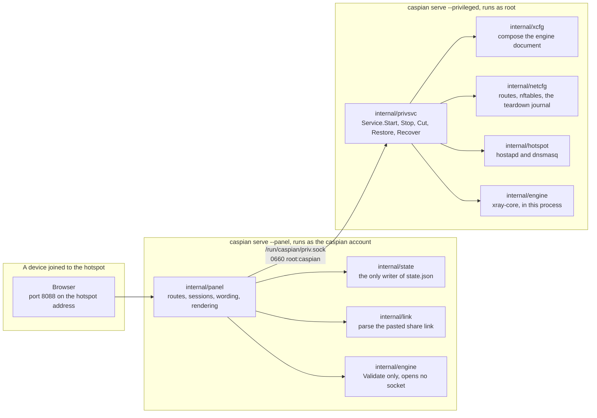
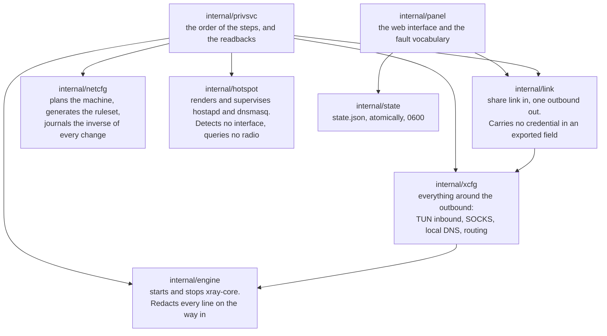
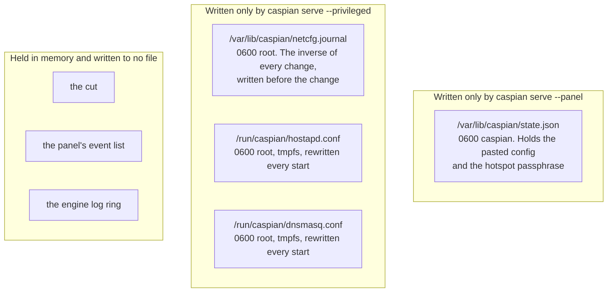
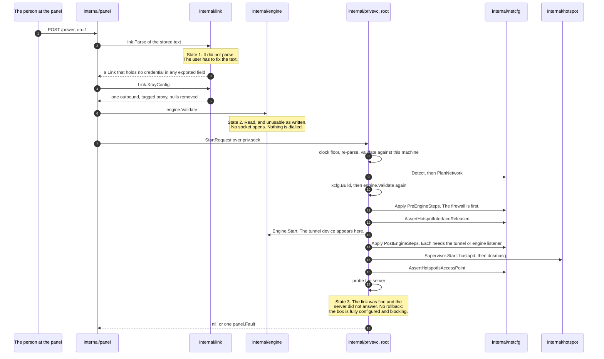
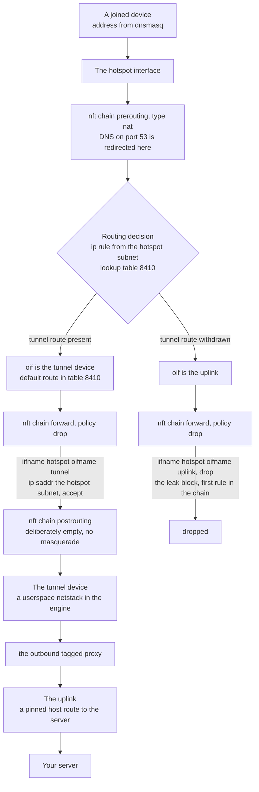
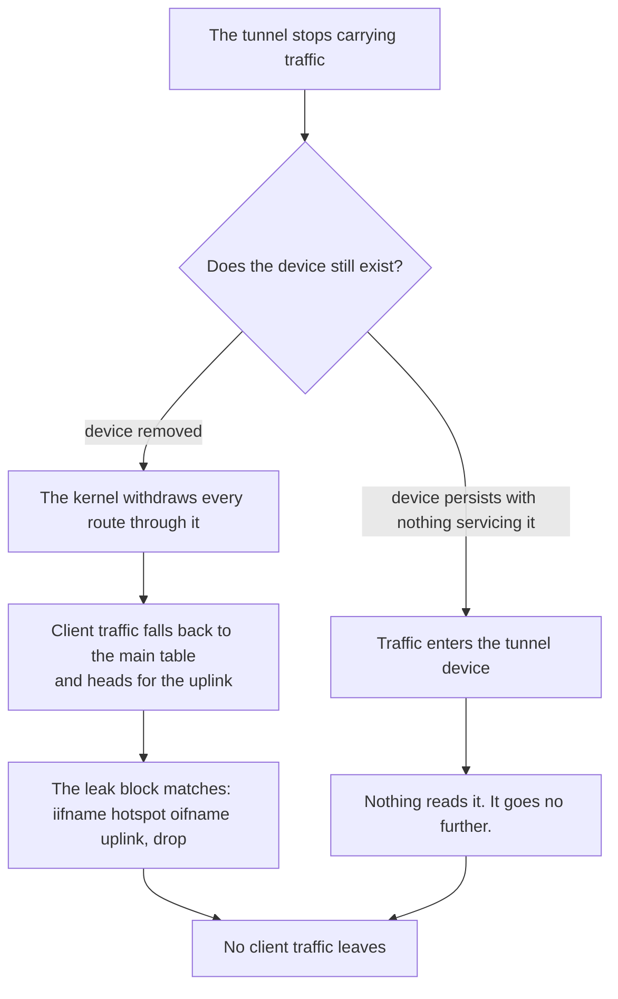
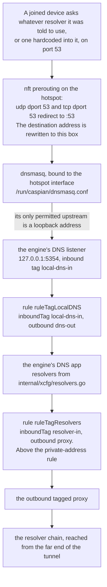
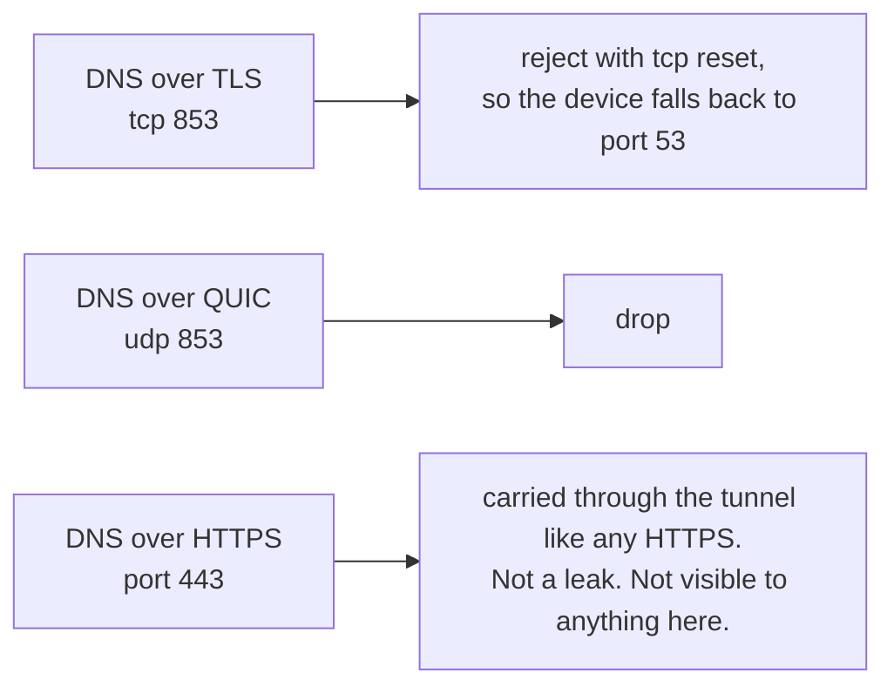
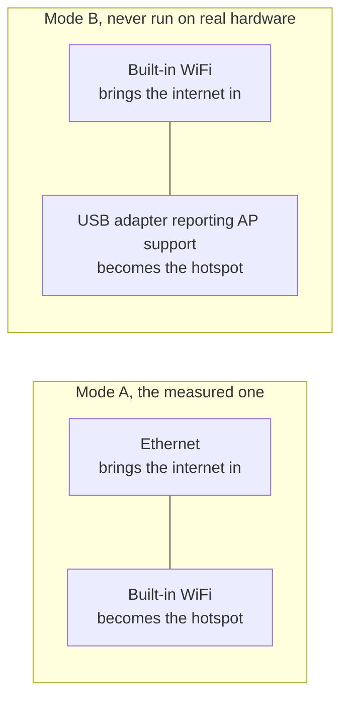
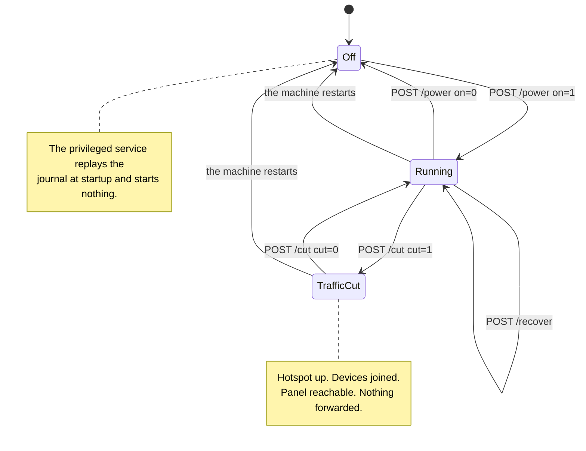

# Caspian-BYOC

[**Download latest release**](https://github.com/zodiacc7/caspian/releases/latest) | [**Open wiki**](https://github.com/Iman/caspian/wiki/Home)

To build the Windows app and installer locally, see [Windows build instructions](docs/WINDOWS-BUILD.md).

<div dir="ltr" align="left">

[English](README.md) | [فارسی](README.fa.md) | [Русский](README.ru.md) | [中文](README.zh.md) | [العربية](https://github.com/Iman/caspian/wiki/Home.ar) | [اردو](https://github.com/Iman/caspian/wiki/Home.ur) | [Türkçe](https://github.com/Iman/caspian/wiki/Home.tr)

</div>

<div dir="ltr" align="left">

[](https://github.com/zodiacc7/caspian/actions/workflows/ci.yml) [](https://github.com/zodiacc7/caspian/releases/latest) [](LICENSE) [](https://github.com/zodiacc7/caspian/releases/latest) [](https://github.com/zodiacc7/caspian/pkgs/container/caspian) [](https://deepwiki.com/Iman/caspian)

</div>


Caspian-BYOC turns a Windows PC, Mac running macOS, Raspberry Pi, or Linux
computer into a bring-your-own-config WiFi gateway. Paste a V2Ray or
Xray-compatible proxy configuration into the web panel and press one switch.
Caspian accepts VLESS,
VMess, Shadowsocks, SOCKS, Trojan, and Hysteria2 share links. It also accepts
Clash and Clash.Meta YAML, raw Xray JSON, link lists, and base64 subscription
data. Caspian connects through Xray-core and shares the tunnel as a WiFi
hotspot, so every device that joins is protected without installing an app.
Optional anti-DPI (DPI circumvention) controls, SNI spoofing and TLS splitting, help the connection start on networks that inspect traffic.


The panel above is a real screenshot from a running box, taken on a Raspberry Pi
5 on 2026-09-03 with the tunnel up, before any device had joined. The network
passphrase, the configuration name and the server address in it are substituted,
and the join code is blurred, because that code encodes the network name and its
password. Nothing else is altered.

The panel opens in English. Choose Persian from the language menu at the top. There is no account, no
telemetry, and the panel fetches nothing from the internet unless you press
Refresh on a subscription address you saved.


## Anti-DPI: SNI spoofing and TLS splitting

Deep packet inspection (DPI) is how a network reads the start of a connection to decide whether to block it. Caspian carries three optional anti-DPI (DPI circumvention) controls, in the panel beside the saved config:

- **Decoy server name.** Caspian sends a TLS greeting that names a decoy domain before the real proxy stream. The real TLS or REALITY server name and the certificate checks stay exactly as they were.
- **TCP split.** The first TLS greeting leaves in two writes, split near the middle of the server name.
- **TLS-record split.** The greeting record is divided at that point without changing the handshake itself.

Each control is independent and can be combined with the others. Saving reconnects a running tunnel with the new settings. They work with VLESS, VMess and Trojan over the supported IPv4 TCP transports, and the two splits need plain TLS.

DPI bypass depends on the network and its filtering rules. Caspian does not promise to be undetectable or universally "DPI safe". The loopback tests verify unchanged data, a real TLS handshake, and rejection of a wrong certificate name; they do not establish bypass against an internet provider. See [SNI setup, supported platforms, and limits](docs/SNI.md) and [upstream research and credits](docs/THIRD-PARTY.md).

## Upstream SOCKS5

Caspian can optionally establish the connection to your configured tunnel server through an upstream SOCKS5 proxy. The upstream proxy is a **front-proxy for the tunnel connection**, not a replacement for the tunnel itself: client traffic still follows Caspian's normal routing into the configured VLESS, VMess, Shadowsocks, SOCKS, Trojan, or Hysteria2 outbound.

Open **Advanced → Upstream SOCKS5**, enable it, and enter the proxy address and port. Username and password are optional. Saving the settings reconnects a running tunnel with the new configuration.

Example:

```text
Address: 127.0.0.1
Port:    1080
Username: optional
Password: optional
```

The password is never rendered back into the page. Leaving the password field blank keeps the saved password when the username is unchanged; leaving both username and password blank clears upstream authentication.

When enabled, Caspian emits an Xray SOCKS5 outbound and chains the configured tunnel outbound through it. The catch-all route remains pointed at the tunnel outbound, so enabling the upstream does not accidentally route ordinary client traffic into the SOCKS5 proxy by itself.

The repository includes an end-to-end test with an in-process SOCKS5 server. It verifies real VLESS traffic in both unauthenticated and authenticated upstream modes and checks that the SOCKS5 server actually received the connection to the VLESS server.

## Connections and supported formats

Start with Ethernet from your router to the computer running Caspian. Use that computer's built-in Wi-Fi for the hotspot, or a compatible USB Wi-Fi adapter on Linux. This gives the internet connection and hotspot separate adapters. It is the recommended starting arrangement, not a measured speed guarantee.

In these diagrams, [1] is your internet router, [2] is the computer running Caspian, and [3] is your phone or another device. ETH means an Ethernet cable. A USB Ethernet adapter brings internet in; a USB Wi-Fi adapter creates a wireless connection. They do different jobs.

```text
A  [1] --ETH--> [2] --built-in Wi-Fi--> [3]
B  [1] --ETH--> [2] --USB Wi-Fi-------> [3]
C  [1] --Wi-Fi A--> [2] --Wi-Fi B----> [3]
D  [1] --Wi-Fi--> [2: one radio] --Wi-Fi--> [3]
```

| Internet into Caspian | Hotspot to your devices | Linux / Raspberry Pi | macOS |
|---|---|---|---|
| A. Ethernet | Built-in Wi-Fi | Supported when the driver can create a hotspot | Supported arrangement |
| B. Ethernet | External USB Wi-Fi | Requires a Linux driver with access point (AP) support | Not supported as the hotspot by Caspian |
| C. Wi-Fi adapter A | Separate Wi-Fi adapter B | Requires AP support on adapter B | An external USB Wi-Fi hotspot is not supported |
| D. Wi-Fi | The same Wi-Fi radio | Conditional: the driver must allow a station and AP together; the channel may be shared | Not supported on the built-in radio |

These are the arrangements the current code can plan or refuse. They do not certify every adapter, OS update, or laptop. A Wi-Fi adapter that can join your home network may still be unable to create a hotspot. Linux USB arrangements have modelled tests; the existing hardware record does not establish that every USB adapter works. On macOS, use Ethernet and built-in Wi-Fi for the documented path. Plugging in USB Wi-Fi does not remove that restriction.

Caspian accepts VLESS, VMess, Shadowsocks, SOCKS, Trojan, and Hysteria2 links, including the hy2 alias. It also accepts supported Clash/Clash.Meta YAML, Xray JSON, lists of links, and base64 subscription content. It uses whichever entry of a list you choose. A subscription address can be saved beside the config and refreshed when you press the button, through the tunnel. Ask your provider for the actual supported configuration, not an account password or a web page link.

Supported transport names include raw/tcp, ws, grpc, httpupgrade, xhttp/splithttp, and kcp/mkcp. Protocol, transport, and security settings must be compatible; not every combination works. TUIC, WireGuard, SSR, AnyTLS, and Hysteria v1 links are not supported. Do not rename an unsupported protocol to make it pass validation. See the protocol guide for restrictions and test evidence.

[For connection diagrams, cable-first setup, service restarts, and common errors, read the home-user troubleshooting guide.](https://github.com/Iman/caspian/wiki/Troubleshooting)

## Install and read the guides

CPU and RAM: Caspian has no measured minimum RAM, CPU core count, or clock speed yet. Resource use depends on traffic volume, proxy protocol, and simultaneous connections. Idle and load benchmarks are needed before minimum requirements can be published.

<div dir="ltr" align="left">

| Topic | English | فارسی | Русский | 中文 | العربية | اردو | Türkçe |
|---|---|---|---|---|---|---|---|
| Getting started | [English](https://github.com/Iman/caspian/wiki/Getting-Started) | [فارسی](https://github.com/Iman/caspian/wiki/Getting-Started.fa) | [Русский](https://github.com/Iman/caspian/wiki/Getting-Started.ru) | [中文](https://github.com/Iman/caspian/wiki/Getting-Started.zh) | [العربية](https://github.com/Iman/caspian/wiki/Getting-Started.ar) | [اردو](https://github.com/Iman/caspian/wiki/Getting-Started.ur) | [Türkçe](https://github.com/Iman/caspian/wiki/Getting-Started.tr) |
| Installation | [English](https://github.com/Iman/caspian/wiki/Installation) | [فارسی](https://github.com/Iman/caspian/wiki/Installation.fa) | [Русский](https://github.com/Iman/caspian/wiki/Installation.ru) | [中文](https://github.com/Iman/caspian/wiki/Installation.zh) | [العربية](https://github.com/Iman/caspian/wiki/Installation.ar) | [اردو](https://github.com/Iman/caspian/wiki/Installation.ur) | [Türkçe](https://github.com/Iman/caspian/wiki/Installation.tr) |
| Install on Linux and Raspberry Pi | [English](https://github.com/Iman/caspian/wiki/Install-Linux) | [فارسی](https://github.com/Iman/caspian/wiki/Install-Linux.fa) | [Русский](https://github.com/Iman/caspian/wiki/Install-Linux.ru) | [中文](https://github.com/Iman/caspian/wiki/Install-Linux.zh) | [العربية](https://github.com/Iman/caspian/wiki/Install-Linux.ar) | [اردو](https://github.com/Iman/caspian/wiki/Install-Linux.ur) | [Türkçe](https://github.com/Iman/caspian/wiki/Install-Linux.tr) |
| Install on macOS | [English](https://github.com/Iman/caspian/wiki/Install-macOS) | [فارسی](https://github.com/Iman/caspian/wiki/Install-macOS.fa) | [Русский](https://github.com/Iman/caspian/wiki/Install-macOS.ru) | [中文](https://github.com/Iman/caspian/wiki/Install-macOS.zh) | [العربية](https://github.com/Iman/caspian/wiki/Install-macOS.ar) | [اردو](https://github.com/Iman/caspian/wiki/Install-macOS.ur) | [Türkçe](https://github.com/Iman/caspian/wiki/Install-macOS.tr) |
| Install on Windows | [English](https://github.com/Iman/caspian/wiki/Install-Windows) | [فارسی](https://github.com/Iman/caspian/wiki/Install-Windows.fa) | [Русский](https://github.com/Iman/caspian/wiki/Install-Windows.ru) | [中文](https://github.com/Iman/caspian/wiki/Install-Windows.zh) | [العربية](https://github.com/Iman/caspian/wiki/Install-Windows.ar) | [اردو](https://github.com/Iman/caspian/wiki/Install-Windows.ur) | [Türkçe](https://github.com/Iman/caspian/wiki/Install-Windows.tr) |
| Protocols and transports | [English](https://github.com/Iman/caspian/wiki/Protocols-and-Transports) | [فارسی](https://github.com/Iman/caspian/wiki/Protocols-and-Transports.fa) | [Русский](https://github.com/Iman/caspian/wiki/Protocols-and-Transports.ru) | [中文](https://github.com/Iman/caspian/wiki/Protocols-and-Transports.zh) | [العربية](https://github.com/Iman/caspian/wiki/Protocols-and-Transports.ar) | [اردو](https://github.com/Iman/caspian/wiki/Protocols-and-Transports.ur) | [Türkçe](https://github.com/Iman/caspian/wiki/Protocols-and-Transports.tr) |
| Architecture and data flow | [English](https://github.com/Iman/caspian/wiki/Architecture) | [فارسی](https://github.com/Iman/caspian/wiki/Architecture.fa) | [Русский](https://github.com/Iman/caspian/wiki/Architecture.ru) | [中文](https://github.com/Iman/caspian/wiki/Architecture.zh) | [العربية](https://github.com/Iman/caspian/wiki/Architecture.ar) | [اردو](https://github.com/Iman/caspian/wiki/Architecture.ur) | [Türkçe](https://github.com/Iman/caspian/wiki/Architecture.tr) |
| Panel and configuration | [English](https://github.com/Iman/caspian/wiki/Panel-and-Configuration) | [فارسی](https://github.com/Iman/caspian/wiki/Panel-and-Configuration.fa) | [Русский](https://github.com/Iman/caspian/wiki/Panel-and-Configuration.ru) | [中文](https://github.com/Iman/caspian/wiki/Panel-and-Configuration.zh) | [العربية](https://github.com/Iman/caspian/wiki/Panel-and-Configuration.ar) | [اردو](https://github.com/Iman/caspian/wiki/Panel-and-Configuration.ur) | [Türkçe](https://github.com/Iman/caspian/wiki/Panel-and-Configuration.tr) |
| Security and privacy | [English](https://github.com/Iman/caspian/wiki/Security-and-Privacy) | [فارسی](https://github.com/Iman/caspian/wiki/Security-and-Privacy.fa) | [Русский](https://github.com/Iman/caspian/wiki/Security-and-Privacy.ru) | [中文](https://github.com/Iman/caspian/wiki/Security-and-Privacy.zh) | [العربية](https://github.com/Iman/caspian/wiki/Security-and-Privacy.ar) | [اردو](https://github.com/Iman/caspian/wiki/Security-and-Privacy.ur) | [Türkçe](https://github.com/Iman/caspian/wiki/Security-and-Privacy.tr) |
| Development and testing | [English](https://github.com/Iman/caspian/wiki/Development-and-Testing) | [فارسی](https://github.com/Iman/caspian/wiki/Development-and-Testing.fa) | [Русский](https://github.com/Iman/caspian/wiki/Development-and-Testing.ru) | [中文](https://github.com/Iman/caspian/wiki/Development-and-Testing.zh) | [العربية](https://github.com/Iman/caspian/wiki/Development-and-Testing.ar) | [اردو](https://github.com/Iman/caspian/wiki/Development-and-Testing.ur) | [Türkçe](https://github.com/Iman/caspian/wiki/Development-and-Testing.tr) |
| Troubleshooting and known defects | [English](https://github.com/Iman/caspian/wiki/Troubleshooting) | [فارسی](https://github.com/Iman/caspian/wiki/Troubleshooting.fa) | [Русский](https://github.com/Iman/caspian/wiki/Troubleshooting.ru) | [中文](https://github.com/Iman/caspian/wiki/Troubleshooting.zh) | [العربية](https://github.com/Iman/caspian/wiki/Troubleshooting.ar) | [اردو](https://github.com/Iman/caspian/wiki/Troubleshooting.ur) | [Türkçe](https://github.com/Iman/caspian/wiki/Troubleshooting.tr) |
| Releases and maintenance | [English](https://github.com/Iman/caspian/wiki/Releases-and-Maintenance) | [فارسی](https://github.com/Iman/caspian/wiki/Releases-and-Maintenance.fa) | [Русский](https://github.com/Iman/caspian/wiki/Releases-and-Maintenance.ru) | [中文](https://github.com/Iman/caspian/wiki/Releases-and-Maintenance.zh) | [العربية](https://github.com/Iman/caspian/wiki/Releases-and-Maintenance.ar) | [اردو](https://github.com/Iman/caspian/wiki/Releases-and-Maintenance.ur) | [Türkçe](https://github.com/Iman/caspian/wiki/Releases-and-Maintenance.tr) |
| Licence and credits | [English](https://github.com/Iman/caspian/wiki/Licence-and-Credits) | [فارسی](https://github.com/Iman/caspian/wiki/Licence-and-Credits.fa) | [Русский](https://github.com/Iman/caspian/wiki/Licence-and-Credits.ru) | [中文](https://github.com/Iman/caspian/wiki/Licence-and-Credits.zh) | [العربية](https://github.com/Iman/caspian/wiki/Licence-and-Credits.ar) | [اردو](https://github.com/Iman/caspian/wiki/Licence-and-Credits.ur) | [Türkçe](https://github.com/Iman/caspian/wiki/Licence-and-Credits.tr) |
| Documentation map | [English](https://github.com/Iman/caspian/wiki/Documentation-Map) | [فارسی](https://github.com/Iman/caspian/wiki/Documentation-Map.fa) | [Русский](https://github.com/Iman/caspian/wiki/Documentation-Map.ru) | [中文](https://github.com/Iman/caspian/wiki/Documentation-Map.zh) | [العربية](https://github.com/Iman/caspian/wiki/Documentation-Map.ar) | [اردو](https://github.com/Iman/caspian/wiki/Documentation-Map.ur) | [Türkçe](https://github.com/Iman/caspian/wiki/Documentation-Map.tr) |
| Translations | [English](https://github.com/Iman/caspian/wiki/Translations) | [فارسی](https://github.com/Iman/caspian/wiki/Translations.fa) | [Русский](https://github.com/Iman/caspian/wiki/Translations.ru) | [中文](https://github.com/Iman/caspian/wiki/Translations.zh) | [العربية](https://github.com/Iman/caspian/wiki/Translations.ar) | [اردو](https://github.com/Iman/caspian/wiki/Translations.ur) | [Türkçe](https://github.com/Iman/caspian/wiki/Translations.tr) |
| Page template | [English](https://github.com/Iman/caspian/wiki/Page-Template) | [فارسی](https://github.com/Iman/caspian/wiki/Page-Template.fa) | [Русский](https://github.com/Iman/caspian/wiki/Page-Template.ru) | [中文](https://github.com/Iman/caspian/wiki/Page-Template.zh) | [العربية](https://github.com/Iman/caspian/wiki/Page-Template.ar) | [اردو](https://github.com/Iman/caspian/wiki/Page-Template.ur) | [Türkçe](https://github.com/Iman/caspian/wiki/Page-Template.tr) |

</div>

## Uninstall

This section is for Linux and Raspberry Pi. Run the copy that the installer left on the box:

    sudo /usr/local/bin/caspian-uninstall

The uninstaller stops both services. Then it replays the network journal, so the routes, firewall rules and sysctl settings return to what they were. Then it removes the units, the binary and the runtime directories. Last, it asks whether to keep `/var/lib/caspian`, which holds the saved configuration.

To delete the saved configuration and the `caspian` account as well, with no questions:

    sudo /usr/local/bin/caspian-uninstall --purge -y

To print every action and take none:

    sudo /usr/local/bin/caspian-uninstall --dry-run

If the journal cannot be replayed, the uninstaller stops the services, removes nothing else, and says so. Run it again with `--force` to remove the software anyway. Then reboot. A reboot returns the network to the box's own configuration.

If the local copy is missing, fetch the same script from this repository:

    /bin/bash -c "$(curl -fsSL https://raw.githubusercontent.com/zodiacc7/caspian/main/uninstall.sh)"

The uninstaller removes only Caspian's own files. It does not remove `hostapd`, `dnsmasq` or any other package.

## Recorded experiments

> This guide comes from the existing README. Its measurements retain their original dates; this documentation move does not report a new test run.
> [English](https://github.com/zodiacc7/caspian/blob/108567a6a529be05b577ee68b65b48790f07e43d/README.md) | [فارسی](https://github.com/zodiacc7/caspian/blob/108567a6a529be05b577ee68b65b48790f07e43d/README.fa.md) | [Русский](https://github.com/zodiacc7/caspian/blob/108567a6a529be05b577ee68b65b48790f07e43d/README.ru.md) | [中文](https://github.com/zodiacc7/caspian/blob/108567a6a529be05b577ee68b65b48790f07e43d/README.zh.md)

### What has carried bytes through a real server

Added by `test/tunnel`. Every scheme the parser accepts is driven end to end
against a real xray-core instance, built from this module's own dependency and
loaded through the same loader `internal/engine` uses. The client side is the
product path, unmodified: `link.Parse`, then `xcfg.Build`, then
`engine.Engine.Start`. No config is hand-written.

| protocol | transport | security | carries an HTTP request |
|---|---|---|---|
| VLESS | tcp (raw) | none | yes |
| VLESS | websocket | none | yes |
| VLESS | grpc | none | yes |
| VLESS | httpupgrade | none | yes |
| VMess | tcp (raw) | none | yes |
| Shadowsocks, aes-256-gcm | tcp (raw) | none | yes |
| SOCKS | tcp (raw) | none | yes |
| Trojan | tcp (raw) | TLS, pinned by digest | yes |
| Hysteria2, and the `hy2` alias | QUIC | TLS, pinned by digest | yes |

Four controls stop a request that skipped the tunnel from passing, and all four
run rather than being asserted in prose. The client is never told where the
origin is, and is given a `.invalid` name and the port of a decoy. The name
cannot be resolved, and the suite says so out loud if a resolver on the machine
answers it anyway. The origin checks where the request was addressed, not only
that it arrived. The decoy counts its own hits, and a tunnelled request must add
none. `TestEveryCarriageProofCanFail` and
`TestTheProofRejectsARequestThatDidNotGoThroughTheTunnel` are what make those
controls evidence rather than intent.

Read each row narrowly. Every row but Hysteria2 runs over TCP: raw for every protocol, and since 2026-09-13 websocket, gRPC and httpupgrade on VLESS as well. No row drives
REALITY, whose server side needs a real handshake target. Shadowsocks is
aes-256-gcm only, because the 2022 ciphers take a different code path. Every row
carries a TCP request, and UDP associate is off. Everything is on loopback, so
no exit IP is captured and none can be.

`TestEveryProtocolTheParserAcceptsIsDrivenEndToEnd` reads the accepted-scheme
list out of `internal/link`'s source, so an eighth scheme cannot be added
without a row here.


### What has actually been proven on hardware

The table below is what real traffic has traversed with an exit IP captured. It
is not what the parser accepts, and it is not what the loopback suite carries.

| protocol | transport | security | proven end to end |
|---|---|---|---|
| VLESS | tcp (raw) | REALITY | yes, on three separate servers |
| VLESS | ws (WebSocket) | none, plus VLESS Encryption | yes |
| VLESS | ws (WebSocket) | TLS | yes, through a CDN |
| VLESS | httpupgrade | TLS | yes, through a CDN |
| VLESS | xhttp | TLS | yes |
| VMess, Trojan, Shadowsocks, SOCKS, Hysteria2 | any | any | no |

Each of those was proven by driving a real browser on a real phone joined to the
hotspot. The exit address was captured from two independent sources and matched
to the server the configuration names. Three different servers were used and
each returned a different address, so a repeated or cached reading cannot be
mistaken for a working tunnel.

A row that is not proven is not a claim that it is broken. It is a claim that
nobody has watched a packet come out of the far end, which is a different thing
and the only thing this project treats as evidence. The engine document each
transport produces IS pinned as a golden file, so a change to how one is
composed shows up as a diff. That proves the document is stable and says nothing
about whether the transport connects.


## What has actually been verified

### The Go suite, this repository, measured 2026-08-31

At commit `5b0a8a7` with a clean working tree, on go1.27.0 darwin/arm64:

    go build ./...                 exit 0
    go test -count=1 -v ./...      exit 0

That run executed 1577 tests including subtests: 1572 passed, 5 skipped, 0
failed. Fifteen packages reported `ok`. Two have no test files: `test/cucumber/harness`
and `local/devpanel`. The five skips announce what they are not proving: the TUN
device lifecycle, which is linux-only and needs root and `/dev/net/tun`, three
dnsmasq configuration checks that need dnsmasq installed, and an opt-in QR PNG
dump.

The previous recorded run, at commit `dd15ad6` on 2026-08-30, executed 1323
tests including subtests: 1319 passed, 4 skipped, 0 failed, across twelve
packages reporting `ok`.

`-count=1` is not optional. It defeats the result cache. Without it a second run
prints the first run's PASS lines and exits 0 having executed nothing.

The full gate is [`scripts/gate.sh`](https://github.com/zodiacc7/caspian/blob/main/scripts/gate.sh): gofmt, `go vet`, the whole suite with the
race detector, and a per-package coverage floor. Read its header before you pipe
it anywhere. A shell pipeline returns the status of its last command, and that
trap has produced a false green in this project before.

[`packaging/test-install.sh`](https://github.com/zodiacc7/caspian/blob/main/packaging/test-install.sh) covers the two shell scripts on any machine with
bash, including one that cannot be installed to.

### The behaviour suite

[`docs/BEHAVIOUR.md`](https://github.com/zodiacc7/caspian/blob/main/docs/BEHAVIOUR.md) lists 24 scenarios. The 2026-08-31 run executed all 24, and
`TestEveryScenarioCanFail` executed 24 matching injected defects, so each
scenario has been watched going red for the specific thing it claims to detect.
`TestBehaviourDocumentListsEveryScenario` fails if the document and the suite
drift apart, in either direction. To run one:

    go test ./test/bdd/ -run 'TestBehaviour/the_firewall'

### The carriage suite

`test/tunnel` drives each of the seven schemes the parser accepts through a real
xray-core server on loopback. Each one has to deliver an HTTP request to an
origin only the far side of the tunnel can reach. See "What has carried bytes through a
real server" above for what each row covers and what it does not. Before this
package existed, the strongest statement held about six of those seven protocols
was that the engine would load the document they produce.

### On the target hardware

[`internal/netcfg/testdata/PROVENANCE.md`](https://github.com/zodiacc7/caspian/blob/main/internal/netcfg/testdata/PROVENANCE.md) is the record, and it is careful about
the difference between what was captured and what was written. Filenames carry
the class: `capture-pi5-` is byte output of a real command on the Pi,
`scenario-` is a machine nobody has measured, and `golden-` is this project's
own output.

Measured on the Pi and recorded there: all five distinct generated rulesets
parsed by `nft -c -f`, with each file's sha256 read back on the Pi rather than
on the developer machine, and `nft list ruleset` empty before and after. The
interface release sequence and its inverses. The driver refusing to create a
second AP interface while accepting a type change on the existing one. The kill
switch's provocations with their negative controls. And the input-policy lockout
that caused that policy to be withdrawn.

That file also records what replacing authored bytes with measured ones broke,
which is the argument for keeping both kinds. Several defects had been green
through every prior run, including a firewall ruleset that no kernel would load
and a teardown that would have switched reverse-path filtering off on a machine
that had it on.

### End to end, with a real phone

The harness is [`test/hardware/caspian-hw`](https://github.com/zodiacc7/caspian/blob/main/test/hardware/caspian-hw) and the runbook is
[`docs/HARDWARE-TEST.md`](https://github.com/zodiacc7/caspian/blob/main/docs/HARDWARE-TEST.md). Its standard is the project's own. A connect is not a
result, and a transport is proven only when real traffic has traversed it and
the exit IP has been captured and matched to the server the config names. An
exit IP equal to the untunnelled baseline is a leak and outranks everything else
in the run. A phone that changed network state mid-capture makes the reading
void, not a pass and not a leak.

A run recorded on 2026-08-30, `run-20260830T144015Z`, graded, over IPv4:

- two configs proven, each `verdict PASS` with `sources agree` and an exit IP
  from both independent sources, matched to the box the config names.
- the exit fingerprint changing when the config was switched.
- the DNS check finding a per-run random `.invalid` label zero times in
  cleartext on the uplink during a 30 second window. Four plaintext DNS packets
  did cross that uplink in that window, and they are the box's own, which the
  design places outside the guarantee. That is exactly why the check looks for a
  label nothing else on the network could have produced, rather than counting
  port 53 packets, which cannot tell an escaped client query from the box's own.
- fail closed: with the engine stopped and the phone's cellular removed by
  airplane mode, neither source reached the internet, while the panel still
  answered over the hotspot. So this was the firewall refusing traffic rather
  than a dead link. Two earlier attempts at that step were graded VOID and
  retaken rather than reported.

Two things about that record. It reached a pass on the third attempt at the last
step, and the two void readings are in the ledger rather than deleted. And the
run artefacts live under `local/`, which is gitignored, so they are **not in
this repository**. If you clone this, you cannot check that run. You can only
re-run the harness yourself.

Two sources are used because one can be cached or stale, and both are pinned to
IP addresses rather than names. [`docs/HARDWARE-TEST.md`](https://github.com/zodiacc7/caspian/blob/main/docs/HARDWARE-TEST.md) explains why in the
paragraph it calls the most important in the file. The resolver on that LAN
sinkholes IP-echo services. So a box that changed nothing but the DNS server,
and tunnelled no traffic at all, would have shown exactly the signature a
name-resolving harness looks for. It would have been graded a pass.

The harness redacts every config, server address, user id and key from
everything it writes. It re-reads each artefact to check the redaction held, and
it has a sweep that re-reads the whole run for anything that escaped the filter. No
packet capture ever leaves the Pi. The tcpdump output is reduced to two integers
on the box, because a capture on that uplink is a recording of the maintainer's
own browsing.

## Architecture and network diagrams






















## Licence

AGPL-3.0-or-later. [LICENSE](LICENSE) | [NOTICE](NOTICE) | [English](https://github.com/Iman/caspian/wiki/Licence-and-Credits) | [فارسی](https://github.com/Iman/caspian/wiki/Licence-and-Credits.fa) | [Русский](https://github.com/Iman/caspian/wiki/Licence-and-Credits.ru) | [中文](https://github.com/Iman/caspian/wiki/Licence-and-Credits.zh) | [العربية](https://github.com/Iman/caspian/wiki/Licence-and-Credits.ar) | [اردو](https://github.com/Iman/caspian/wiki/Licence-and-Credits.ur) | [Türkçe](https://github.com/Iman/caspian/wiki/Licence-and-Credits.tr)

<!-- SNI upstream credits -->

SNI spoofing credits: [patterniha/SNI-Spoofing](https://github.com/patterniha/SNI-Spoofing) (GPL-3.0), with WinDivert (LGPL-3.0) on Windows x64.
[Third-party licenses, source versions, and credits](docs/THIRD-PARTY.md).
